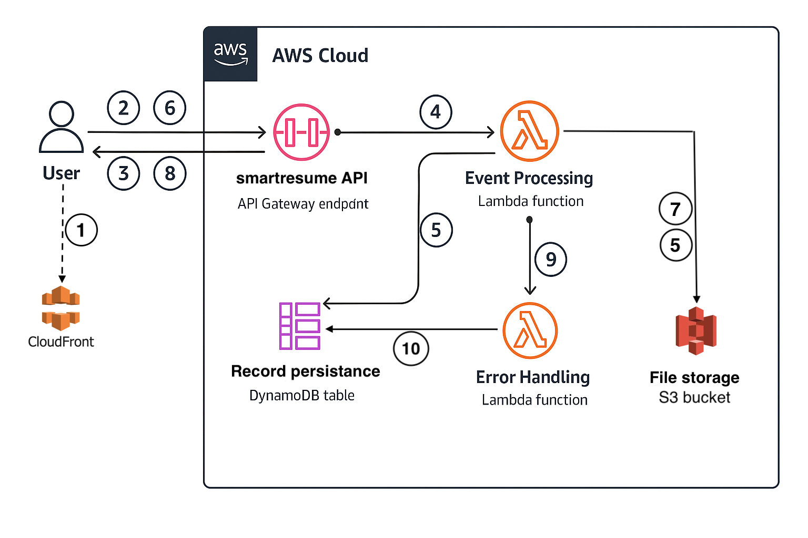

# Arhitecture Design

# Typical work flow

1. User sends an HTTP POST request to the '/' of smartresume API endpoint, specifying the job parameters in the request body. 

2. The smartresume API, which is an API Gateway REST API, returns an HTTP response to the user that contains the request Id identifier. This identifier will act as the session id w.r.t. the particular communication series with the user & application.

3. The smartresume API invokes asynchronously the event-processing Lambda function. 

4. The event-processing smartresume Lambda function processes the event by invoking an OPENAI API, writes the response into a PDF file & uploads the same in S3 smartresume bucket and saves the corresponding URL in smartresume Amazon DynamoDB table against the session id from step 2 as the key. 

5. User sends an HTTP GET request to the /final API endpoint, with the session id from step 2. 

6. This request is synchronous, hence it invokes the smartresume lambda function in the same flow. It queries the smartresume DynamoDB table to retrieve the S3 URL. 

7. The smartresume Lambda function then fetches the file itself from S3, which is then written as HTTP response. 

8. The /final API endpoint returns an HTTP response that contains the requested file. 

9. If the smartresume lambda function somehow fails, it is sent to the error-handling smartresumeError lambda function. 

10. The smartresumeError lambda function puts the session id in the same smartresume DynamoDB table 4 along with any relevant message.

# Built with

* AWS API Gateway 
* AWS Cloudfront 
* AWS DynamoDB 
* AWS S3 
* AWS Lambda 
* Python 
* OpenAI 
